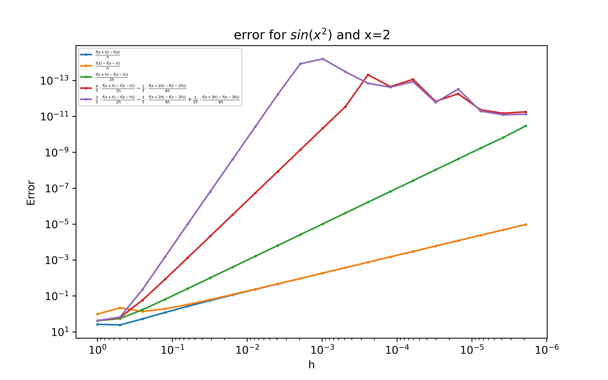
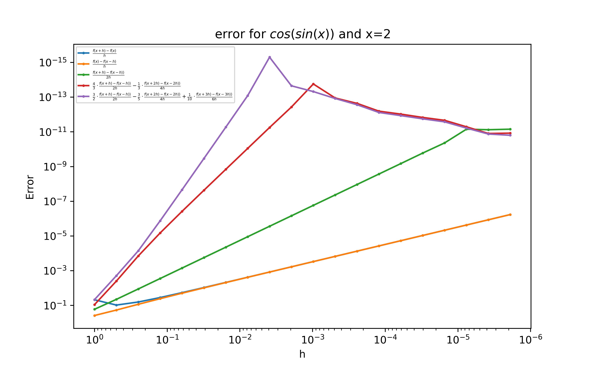
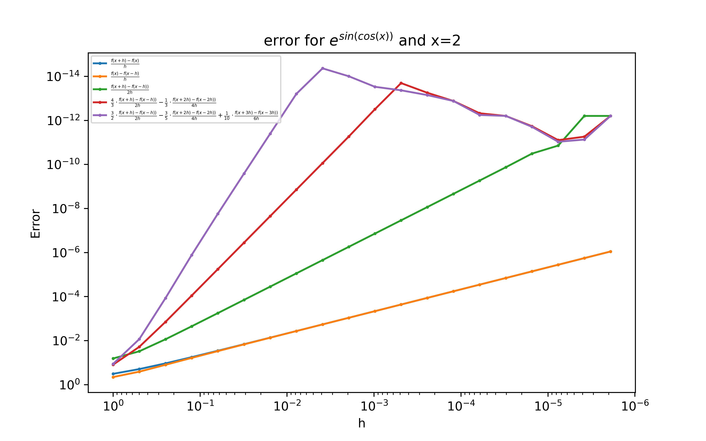
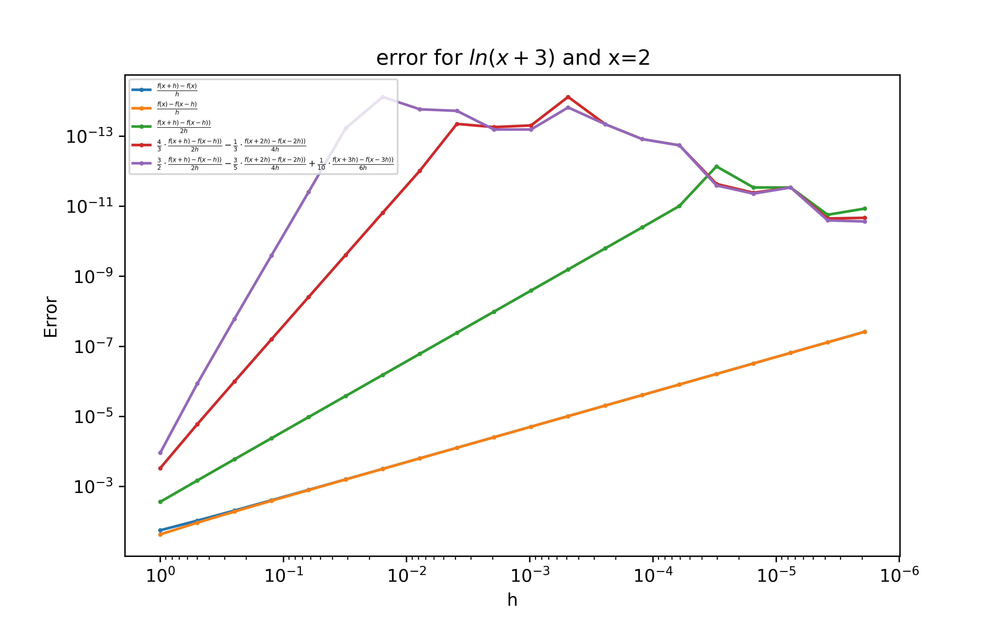
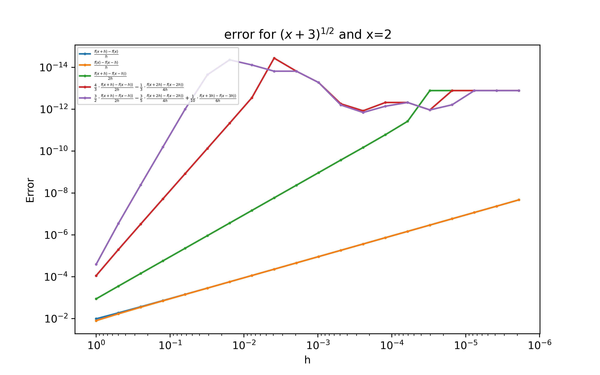
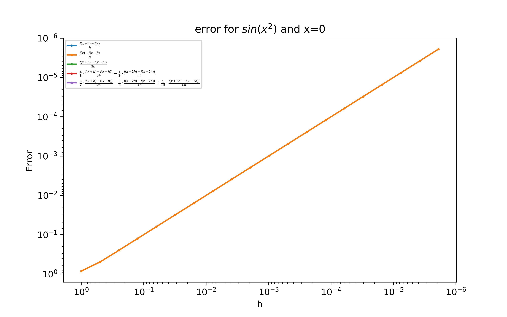
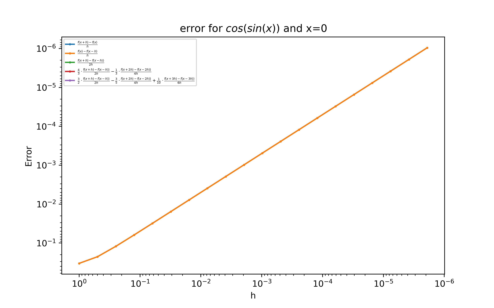
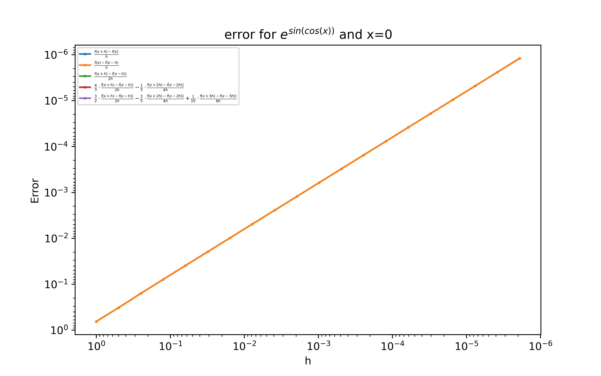
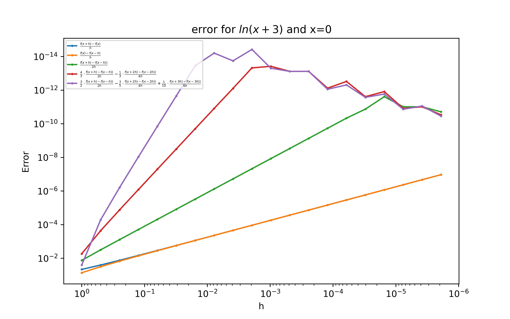
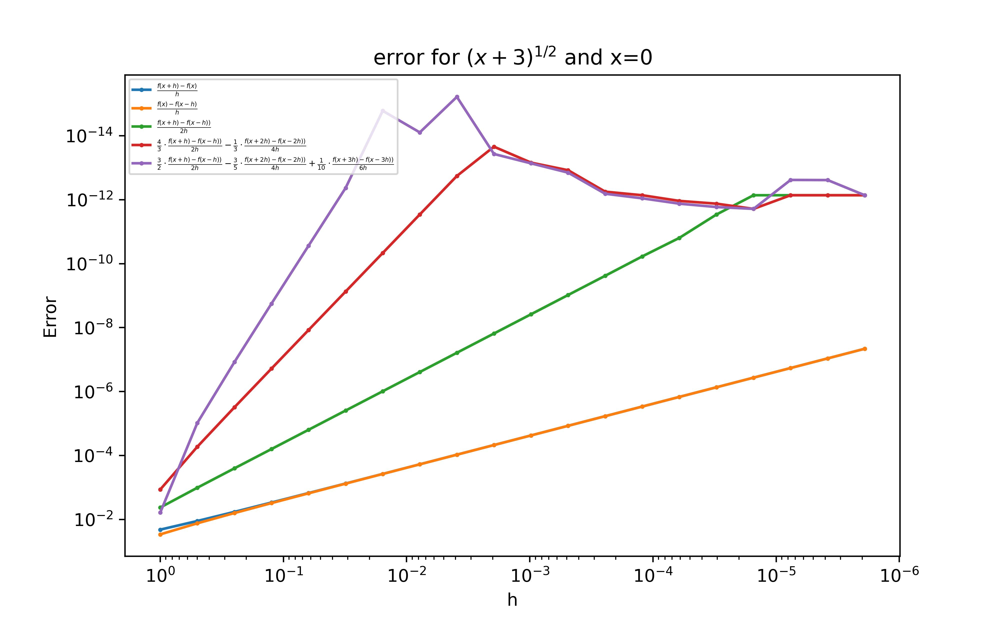

# Initial data
### Using functions near derivatives:
* $sin(x^2)$ *->* $cos(x^2)\cdot 2x$

* $cos(sin(x))$ *->* $-sin(sin(x))*cos(x)$

* $e^{sin(cos(x))}$ *->* $e^{sin(cos(x))}\cdot cos(cos(x))(-sin(x))$

* $ln(x+3)$ *->* $\frac{1}{x+3}$

* $\sqrt{(x+3)}$ *->* $\frac{1}{2}\cdot \frac{1}{\sqrt{(x+3)}}$

### Approximation formulas:
* $\frac{f(x+h) - f(x)}{h}$

* $\frac{f(x) - f(x-h)}{h}$

* $\frac{f(x+h) - f(x-h)}{2h}$

* $\frac{4}{3}\cdot\frac{f(x+h) - f(x-h)}{2h} - \frac{1}{3}\cdot\frac{f(x+2h) - f(x-2h)}{4h}$

* $\frac{3}{2}\cdot\frac{f(x+h) - f(x-h)}{2h} - \frac{3}{5}\cdot\frac{f(x+2h)\ - f(x-2h)}{4h} + \frac{1}{10}\cdot\frac{f(x+3h) - f(x-3h)}{6h}$

# Results

# For x=2 

  
  
# For x=0:

