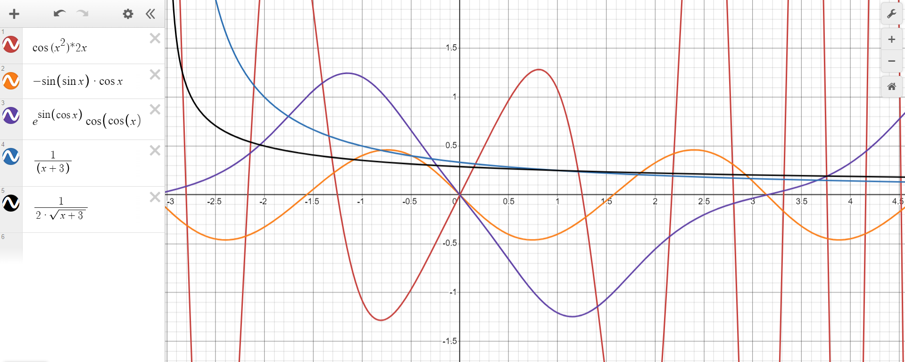
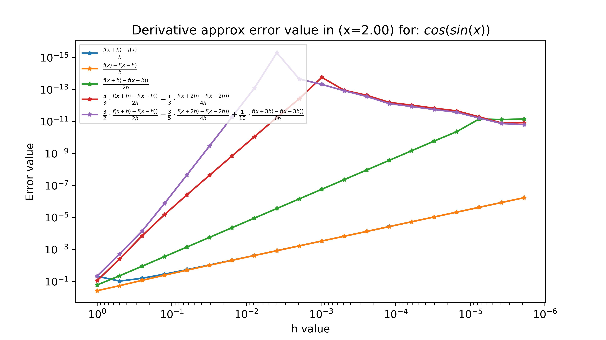
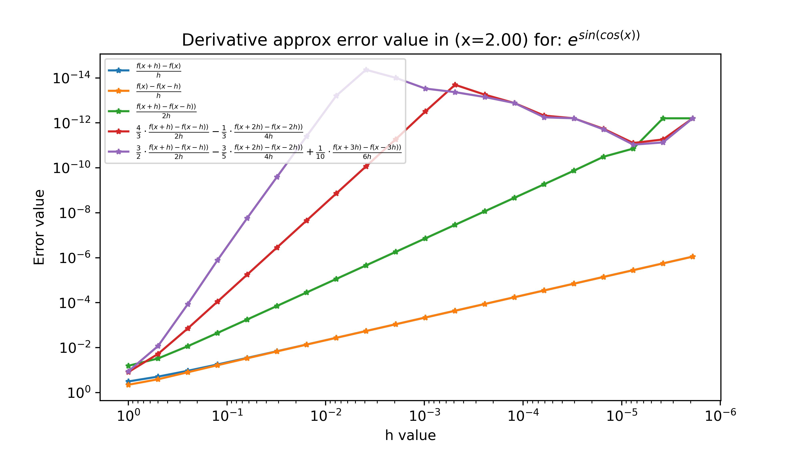
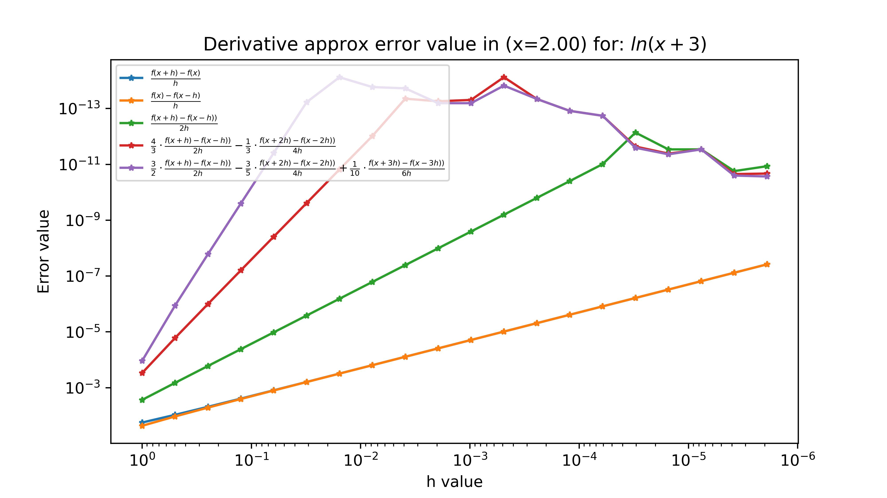
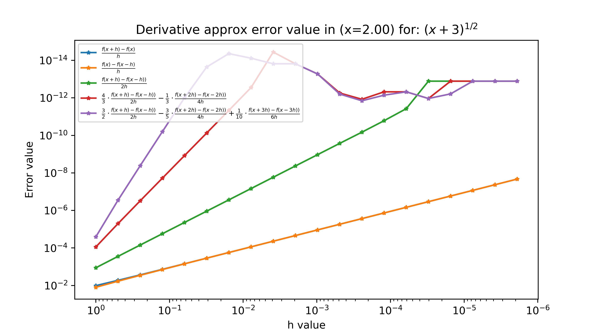
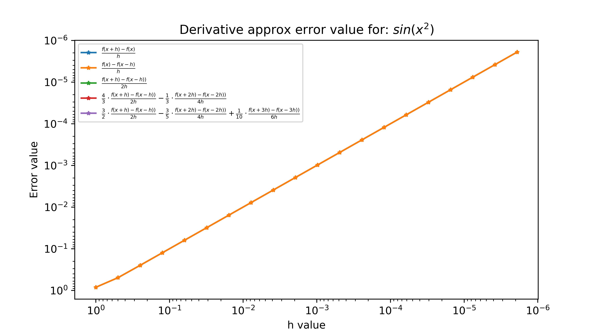
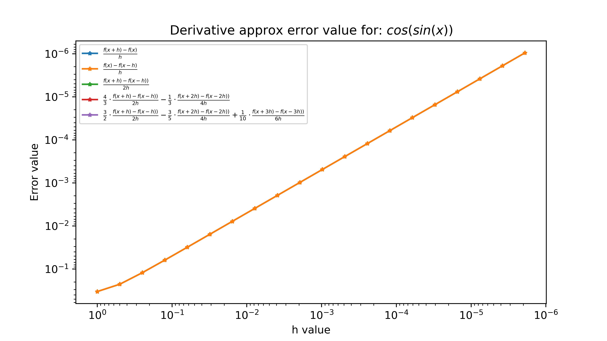
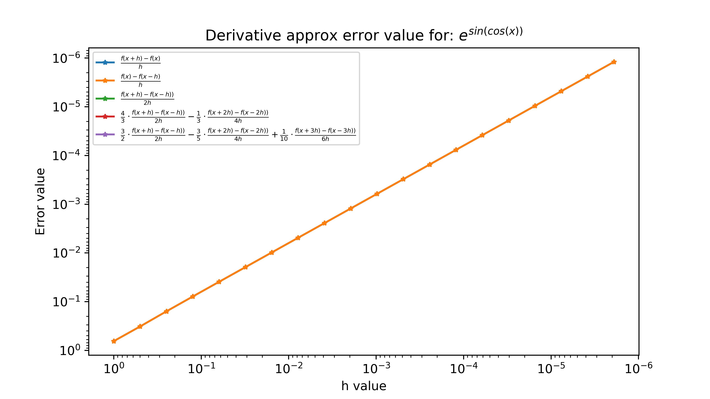
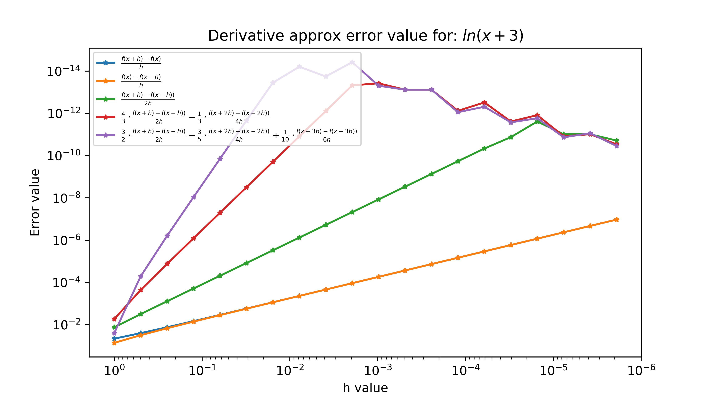
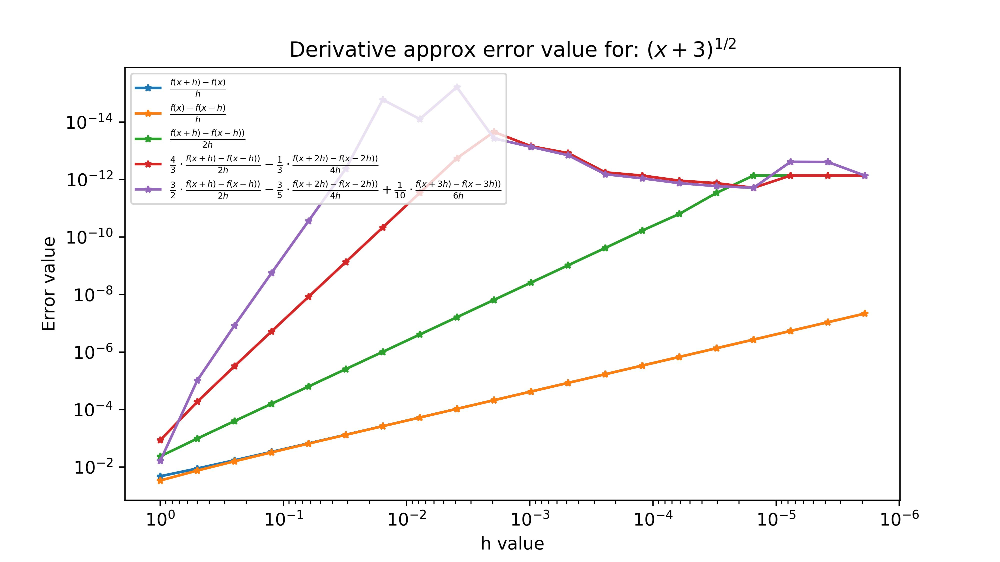

# Report of 1st Laboratory

## Methodology

The paper investigates the dependences of the absolute errors in the calculation of derivative functions by the numerical method. 5 functions are used for research, 5 approximation formulas are used for modeling.

The step(h value) is depends as $h_n = \frac{2}{2^{n}} = \frac{1}{2^{n-1}} = 2^{1-n}$; $n = \overline{1,21}$
### List of using functions(near derivatives):
* $sin(x^2)$ *->* $cos(x^2)\cdot 2x$

* $cos(sin(x))$ *->* $-sin(sin(x))*cos(x)$

* $e^{sin(cos(x))}$ *->* $e^{sin(cos(x))}\cdot cos(cos(x))(-sin(x))$

* $ln(x+3)$ *->* $\frac{1}{x+3}$

* $\sqrt{(x+3)}$ *->* $\frac{1}{2}\cdot \frac{1}{\sqrt{(x+3)}}$

Graphics(around x=0) of these functions you can found below:

### List of approximation formulas:
*  $\frac{f(x+h) - f(x)}{h}$

* $\frac{f(x) - f(x-h)}{h}$

* $\frac{f(x+h) - f(x-h)}{2h}$

* $\frac{4}{3}\cdot\frac{f(x+h) - f(x-h)}{2h} - \frac{1}{3}\cdot\frac{f(x+2h) - f(x-2h)}{4h}$

* $\frac{3}{2}\cdot\frac{f(x+h) - f(x-h)}{2h} - \frac{3}{5}\cdot\frac{f(x+2h)\ - f(x-2h)}{4h} + \frac{1}{10}\cdot\frac{f(x+3h) - f(x-3h)}{6h}$

## Results:

#### Results present below and calculated for x = 2.

>[Back to Methodology](#methodology)

>[Back to Methodology](#methodology)

>[Back to Methodology](#methodology)

>[Back to Methodology](#methodology)

>[Back to Methodology](#methodology)
#### Results present below and calculated for x = 0. 

>[Back to Methodology](#methodology)

>[Back to Methodology](#methodology)

>[Back to Methodology](#methodology)

>[Back to Methodology](#methodology)

>[Back to Methodology](#methodology)