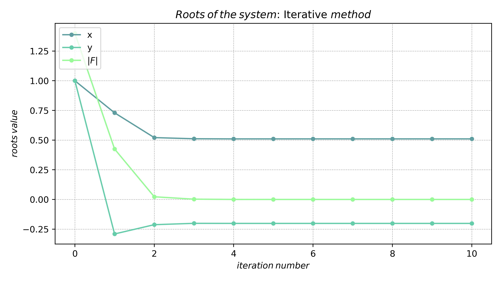
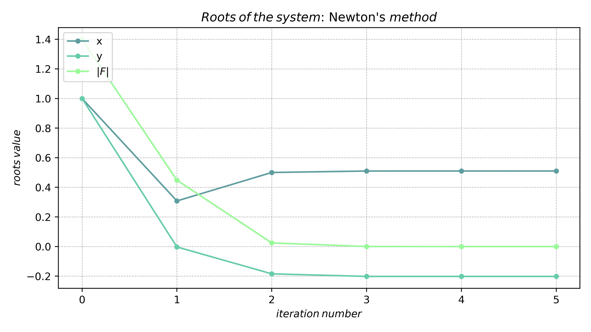
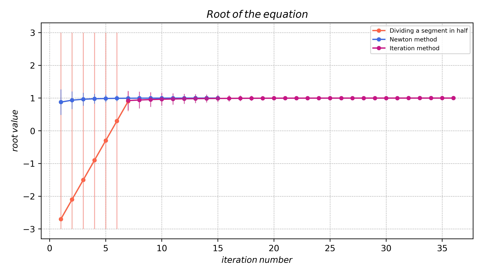
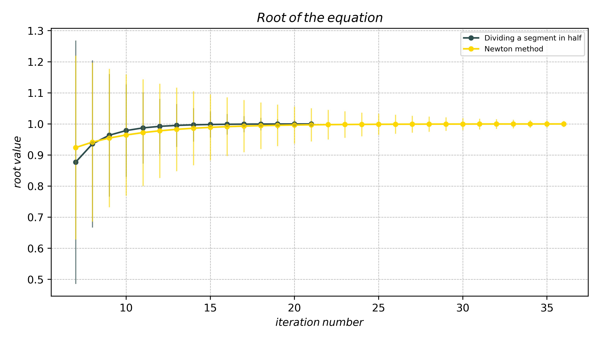

# Report of 3rd Laboratory


### Please install sympy first
``` bash
pip install sympy
```


#### System of equations:

$$
  \begin{cases} 
  sin(x+1) - y = 1.2 \\
  2x + cos(y) = 2 \\
  \end{cases}
$$

| Method    |          Found root          | Iteration count |
| :-------- | :--------------------------: | :-------------: |
| Iterative | $x=0.51015016, y=0.20183842$ |       10        |
| Newton's  | $x=0.51015016, y=0.20183842$ |        5        |






#### Single equation:

$$
2x^2 - 5x + 3 = 0
$$





| Method    |   Found root   |
| :-------- | :------------: |
| Iterative | $1.0\pm\sigma$ |
| Newton's  | $1.0\pm\sigma$ |

